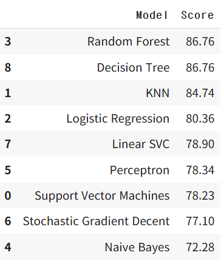

# 캐글로리
## 🚣 Titanic 필사노트
### 1. 라이브러리 불러오기

```python
import pandas as pd
import numpy as np
import random as rnd

import seaborn as sns
import matplotlib.pyplot as plt
%matplotlib inline

from sklearn.linear_model import LogisticRegression, Perceptron, SGDClassifier
from sklearn.svm import SVC, LinearSVC
from sklearn.ensemble import RandomForestClassifier
from sklearn.neighbors import KNeighborsClassifier
from sklearn.naive_bayes import GaussianNB
from sklearn.tree import DecisionTreeClassifier
```

> kaggle 환경에서는 `%matplotlib inline`이 자동이지만 파이썬에서는 필요 없음.

---

### 2. 데이터 불러오기

```python
train_df = pd.read_csv('/content/drive/MyDrive/다트비/0차시.타이타닉/titanic/asset/train.csv')
test_df = pd.read_csv('/content/drive/MyDrive/다트비/0차시.타이타닉/titanic/asset/test.csv')
combine = [train_df, test_df]
```

---

### 3. 데이터 구조 확인

```python
print(train_df.columns.values)

train_df.info()
print('_'*40)
test_df.info()

train_df.describe()
train_df.describe(include=['O'])
```
- (include=['O']) : 문자열 타입의 열들만 추출됨.
---

### 4. 피쳐별 생존률 확인인

```python
train_df[['Pclass', 'Survived']].groupby('Pclass').mean().sort_values('Survived', ascending=False)

train_df[['Sex', 'Survived']].groupby('Sex').mean().sort_values('Survived', ascending=False)

train_df[['SibSp', 'Survived']].groupby('SibSp').mean()
train_df[['Parch', 'Survived']].groupby('Parch').mean()
```

---

### 5. 시각화(EDA)

```python
sns.FacetGrid(train_df, col='Survived').map(plt.hist, 'Age', bins=20)
sns.FacetGrid(train_df, row='Pclass', col='Survived').map(plt.hist, 'Age', bins=20)
sns.FacetGrid(train_df, row='Embarked', col='Survived').map(sns.barplot, 'Sex', 'Fare', ci=None)
```

---

### 6. 피쳐 엔지니어링

#### 이름에서 Title 추출
```python
for dataset in combine:
    dataset['Title'] = dataset.Name.str.extract(' ([A-Za-z]+)\\.', expand=False)
```

#### Title 정리 및 인코딩
```python
for dataset in combine:
    dataset['Title'] = dataset['Title'].replace(['Lady', 'Countess','Capt', 'Col',
        'Don', 'Dr', 'Major', 'Rev', 'Sir', 'Jonkheer', 'Dona'], 'Rare')
    dataset['Title'] = dataset['Title'].replace(['Mlle', 'Ms'], 'Miss')
    dataset['Title'] = dataset['Title'].replace('Mme', 'Mrs')

title_mapping = {"Mr":1, "Miss":2, "Mrs":3, "Master":4, "Rare":5}
for dataset in combine:
    dataset['Title'] = dataset['Title'].map(title_mapping).fillna(0)
```
#### 새로운 피처 생성
```python
for dataset in combine:
    dataset['FamilySize'] = dataset['SibSp'] + dataset['Parch'] + 1
    dataset['IsAlone'] = 0
    dataset.loc[dataset['FamilySize'] == 1, 'IsAlone'] = 1
    dataset['Age*Class'] = dataset['Age'] * dataset['Pclass']
```

#### 불필요한 피처 제거
```python
train_df = train_df.drop(['SibSp', 'Parch', 'FamilySize'], axis=1)
test_df = test_df.drop(['SibSp', 'Parch', 'FamilySize'], axis=1)
```

#### 분석에 필요한 컬럼만 남기기
```python
train_df = train_df.drop(['Name', 'Ticket', 'Cabin', 'PassengerId'], axis=1)
test_df = test_df.drop(['Name', 'Ticket', 'Cabin'], axis=1)
```

### 7. 데이터 인코딩 & 결측치 보간간

#### Sex → 숫자 변환(매핑)
```python
for dataset in combine:
    dataset['Sex'] = dataset['Sex'].map({'female': 1, 'male': 0}).astype(int)
```
> 원핫 인코딩 하면 될 것 같음.

#### Age → 그룹화 & 결측치 보간간
```python
guess_ages = np.zeros((2,3))
for dataset in combine:
    for i in range(2):
        for j in range(3):
            guess_df = dataset[(dataset['Sex']==i) & (dataset['Pclass']==j+1)]['Age'].dropna()
            age_guess = guess_df.median()
            guess_ages[i,j] = age_guess

    for i in range(2):
        for j in range(3):
            dataset.loc[(dataset.Age.isnull()) & (dataset.Sex==i) & (dataset.Pclass==j+1), 'Age'] = guess_ages[i,j]

    dataset['Age'] = dataset['Age'].astype(int)
```
> 남/녀 * Pclass 6가지 조합의 중앙값을 저장할 배열 만듦. Age 중앙값 계산해서 저장. 성별 + 객실 등급이 비슷한 사람들의 나이 중앙값으로 결측치를 채운 것.

#### Embarked 결측값 처리 + 숫자 인코딩
```python
freq_port = train_df.Em
for dataset in combine:
    dataset['Embarked'] = dataset['Embarked'].fillna(freq_port)
    dataset['Embarked'] = dataset['Embarked'].map({'S': 0, 'C': 1, 'Q': 2}).astype(int)
```
> 지역적 특성 반영

##### Fare 결측값 처리 + 구간화
```python
test_df['Fare'].fillna(test_df['Fare'].dropna().median(), inplace=True)
train_df['FareBand'] = pd.qcut(train_df['Fare'], 4)
for dataset in combine:
    dataset.loc[dataset['Fare'] <= 7.91, 'Fare'] = 0
    dataset.loc[(dataset['Fare'] > 7.91) & (dataset['Fare'] <= 14.454), 'Fare'] = 1
    dataset.loc[(dataset['Fare'] > 14.454) & (dataset['Fare'] <= 31), 'Fare'] = 2
    dataset.loc[dataset['Fare'] > 31, 'Fare'] = 3
    dataset['Fare'] = dataset['Fare'].astype(int)
train_df = train_df.drop(['FareBand'], axis=1)
```
### 모델링
```python
# 학습용 입력 데이터와 타겟(정답) 데이터 분리
X_train = train_df.drop("Survived", axis=1)
Y_train = train_df["Survived"]

# 테스트용 데이터 복사
X_test  = test_df.copy()

# 모델 이름과 정확도(훈련 데이터 기준)를 저장할 리스트
models = []

# Logistic Regression (로지스틱 회귀)
logreg = LogisticRegression()
logreg.fit(X_train, Y_train)
models.append(('Logistic Regression', logreg.score(X_train, Y_train)))

# Support Vector Classifier (서포트 벡터 머신)
svc = SVC()
svc.fit(X_train, Y_train)
models.append(('SVC', svc.score(X_train, Y_train)))

# K-Nearest Neighbors (KNN, 가장 가까운 이웃)
knn = KNeighborsClassifier(n_neighbors=3)
knn.fit(X_train, Y_train)
models.append(('KNN', knn.score(X_train, Y_train)))

# Gaussian Naive Bayes (가우시안 나이브 베이즈)
gaussian = GaussianNB()
gaussian.fit(X_train, Y_train)
models.append(('Naive Bayes', gaussian.score(X_train, Y_train)))

# Perceptron (단순 신경망 구조)
perceptron = Perceptron()
perceptron.fit(X_train, Y_train)
models.append(('Perceptron', perceptron.score(X_train, Y_train)))

# Linear Support Vector Classifier (선형 SVM)
linear_svc = LinearSVC()
linear_svc.fit(X_train, Y_train)
models.append(('Linear SVC', linear_svc.score(X_train, Y_train)))

# Stochastic Gradient Descent (확률적 경사하강법)
sgd = SGDClassifier()
sgd.fit(X_train, Y_train)
models.append(('SGD', sgd.score(X_train, Y_train)))

# Decision Tree (의사 결정 트리)
decision_tree = DecisionTreeClassifier()
decision_tree.fit(X_train, Y_train)
models.append(('Decision Tree', decision_tree.score(X_train, Y_train)))

# Random Forest (랜덤 포레스트, 앙상블 학습)
random_forest = RandomForestClassifier(n_estimators=100)
random_forest.fit(X_train, Y_train)
models.append(('Random Forest', random_forest.score(X_train, Y_train)))

# 훈련 정확도를 기준으로 성능 순위 출력
for name, score in sorted(models, key=lambda x: x[1], reverse=True):
    print(f"{name}: {score:.4f}")barked.dropna().mode()[0]
```
### 📊 모델별 성능 및 특징 비교표

| 모델                | 훈련 정확도 | 장점                                     | 단점                                 | 특징 요약                     |
|---------------------|--------------|------------------------------------------|--------------------------------------|-------------------------------|
| Random Forest       | ★★★★★       | 과적합 방지, 변수 중요도 추출 가능        | 느릴 수 있음                         | 앙상블 기반, 안정적 성능       |
| Decision Tree       | ★★★★★       | 직관적 해석, 빠른 속도                    | 과적합에 민감                        | 단일 결정 트리, 직관적         |
| KNN                 | ★★★★☆       | 구현 단순, 튜닝 쉬움                      | 느림, 고차원 데이터에 취약           | 주변 데이터 기반 분류          |
| SVC (RBF)           | ★★★★☆       | 비선형 분류에 강함                        | 느림, 파라미터 튜닝 필요             | 마진 기반 분류기              |
| Logistic Regression | ★★★★☆       | 빠름, 확률 예측 가능                      | 비선형 문제에 약함                   | 선형 회귀 기반 분류            |
| Linear SVC          | ★★★★☆       | 빠름, 고차원 데이터에 잘 작동             | 비선형 문제에 부적합                 | 선형 마진 분류기              |
| Perceptron          | ★★★☆☆       | 단순 구조, 빠른 학습                      | 안정성 낮음, 비선형에 약함           | 고전적 신경망                  |
| SGD Classifier      | ★★★☆☆       | 매우 빠름, 대용량 데이터에 적합           | 불안정, 튜닝 어려움                  | 경사하강 기반 선형 분류기      |
| Naive Bayes         | ★★☆☆☆       | 빠름, 적은 데이터에도 잘 작동             | 독립성 가정이 현실과 다름            | 확률 기반, 텍스트에 적합       |

### 결과 예측 및 제출 파일 생성
```python
Y_pred = random_forest.predict(X_test)
submission = pd.DataFrame({
    "PassengerId": test_df["PassengerId"],
    "Survived": Y_pred
})
submission.to_csv('submission.csv', index=False)
```
### 모델 성능


## 인사이트
> Title 피처, 결측값 처리, 모델링(모델의 종류), 과적합 여부?

## 스터디 후
- SVM : 로지스틱 회귀모형 단점 보완. 지도학습 알고리즘.
  - **분류 문제**에서의 SVM : 여백(마진)이란 주어진 데이터가 오류를 발생시키지 않고 움직일 수 있는 최대 공간. 여백이 작다는 것은 새로운 데이터가 들어올 경우 오류가 발생할 가능성이 높다는 것을 의미.
  - **회귀 문제**에서의 SVM : 오류가 발생하지 않는 범위가 여백임.
  - SVM의 종류
    - 선형 SVM : 2D, 3D 형태로 데이터 나눔.
    - 비선형 SVM : 