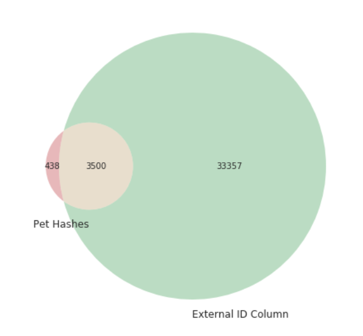

# 캐글로리 5주차
## PetFinder.my Adoption Prediction
### how bestpetting cheated
#### labels.csv
외부 유출된 PetID+숫자와 AdoptionSpeed가 섞인 데이터 셋 -> 치팅에 쓰임.
#### 해싱
pet 정보를 md5 해싱하여 고유 식별값을 생성
#### cheating 과정
유출된 데이터세을 dict으로 변환\
벤다이어그램으로 중복확인.

일치하는 해시가 있다면 대응 되는 AdoptionSpeed를 부여, 없으면 기본값 2.
```python
test["AdoptionSpeed"] = hashed_pet_info.apply(lambda x: hash_dict.get(x, 2))
test[["PetID", "AdoptionSpeed"]].to_csv("submission.csv", index=False)
```
해시 끝자리 숫자 분포 분석
- 유출된 id에서 끝자리 숫자들의 분포 확인. 치팅이 아닌 정상적인 랜덤 해시라면 균등분포를 따름.\
실제 무작위 문자열을 해시한 결과의 끝자리 분포와 비교.

+ 모드 방식으로 추가적인 개선 시도.. 

#### cheating의 목적
예측을 할 때 머신러닝 모델로 학습해서 하는 게 아니라, 유출된(또는 외부에서 수집된) labels.csv 파일을 이용해서 예측값을 알아내려는 꼼수 전략.
"치팅", "Leak Exploitation"이라고도 불림.

#### 해싱이란..
어떤 데이터를 고정된 길이의 문자열로 암호화하거나 변형하는 기법.

여기서 사용한 건 md5()라는 해시 함수로, 입력값이 같으면 항상 같은 출력값(해시값)을 줌.

#### 왜 해싱을 쓰는가?
대회에서 test.csv에는 'AdoptionSpeed'가 없음.
하지만 외부에서 PetID와 특성이 비슷한 데이터와 그 결과(labels.csv)가 유출되었음. 그런데 PetID는 고유하니까 바로 매칭이 안 됨.

<그래서>
test 데이터의 주요 특성들을 문자열로 합쳐서 md5()로 해시값을 만든 후 유출된 labels.csv에 있는 해시값들과 일치하는지 확인하고 일치하면 그 해시에 해당하는 AdoptionSpeed를 가져와서 예측값으로 씀..
